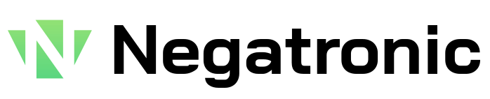

Negatronic is an ASCII only fork of [Bai Jamjuree](https://github.com/cadsondemak/Bai-Jamjuree) with minor changes. See [Bai Jamjuree on Google Fonts](https://fonts.google.com/specimen/Bai+Jamjuree).

## Changes

1. The height of the lowercase letters has been standardized. 
2. Letters avoid going under the baseline.
3. All capital letters have the same height.
4. No lowercase letter is higher than a capital letter.
5. The extra rounded corner found on some letters has been removed.
6. The name has been changed from "Bai Jamjuree" to "Negatronic" so that the fonts are clearly distinct and because remembering the old name proved problematic. Additionally, this avoids the potential licensing problem with "Reserved Font Name(s)".

The changes were mainly made so that the font can be rendered nearly pixel perfect on displays. Additionally, removing the extra rounded corner gives some of the letters a higher degree of symmetry.

## Font Weights

Currently only the bold font has been converted.

## Web Usage

To use the fonts on a website, you should link to Css/Negatronic.css

```
<link rel="stylesheet" href="path/to/this/directory/Negatronic/Css/Negatronic.css" />
```

## License

The license of this project is OFL.